# The LabrINth

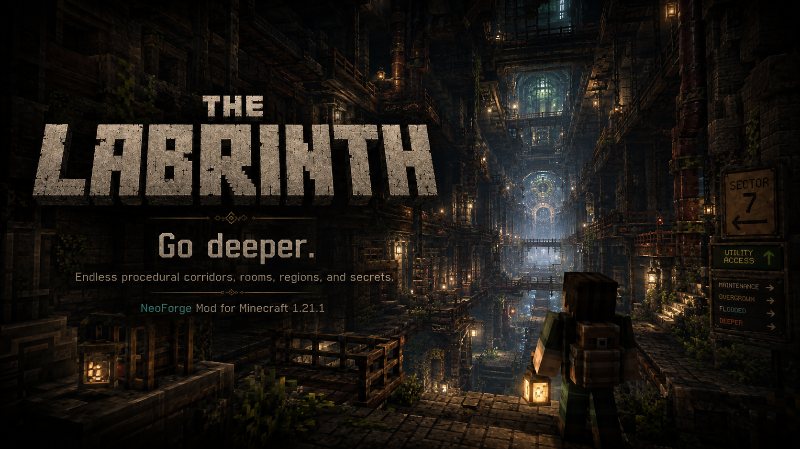

> **There is no end. There is only another hallway.**

**The Labrinth** is a Minecraft **NeoForge** mod for **Minecraft 1.21.1** that introduces an entirely new dimension composed of sprawling corridors, twisting hallways, interconnected rooms, hidden passages, and structures that seem to continue forever.

Rather than generating a traditional Minecraft world filled with open terrain, mountains, oceans, and biomes, The Labrinth generates a world almost entirely from **interior spaces**.

Every direction leads deeper.

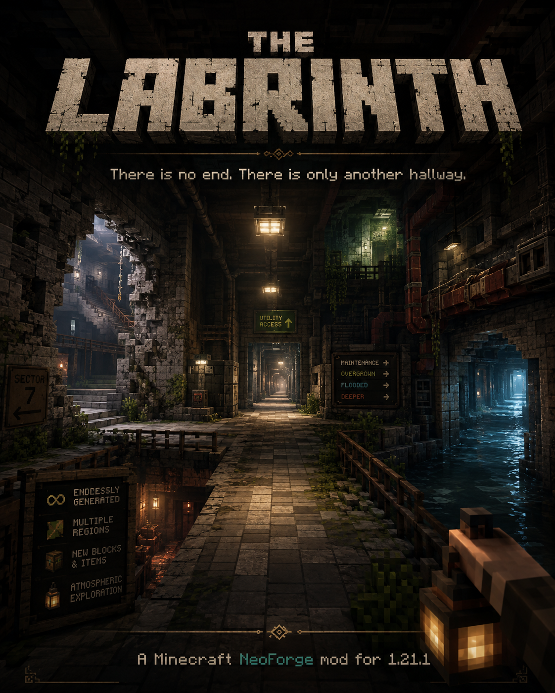

---

## The Labrinth

The Labrinth is an enormous procedurally generated maze-like dimension built from interconnected pieces.

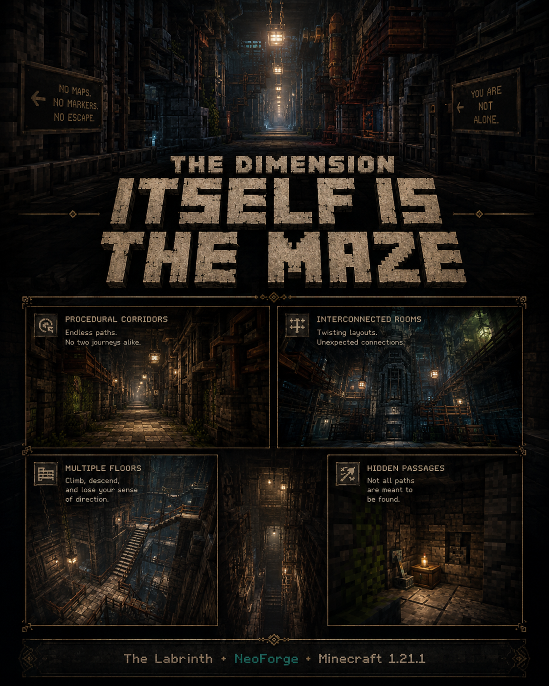

Its world generation can create:

* Long corridors
* Narrow passageways
* Large chambers
* Small rooms
* Intersections
* Stairwells
* Vertical shafts
* Dead ends
* Hidden passages
* Utility spaces
* Unusual structures
* Rare landmarks
* Secret rooms
* Multiple floors and elevations

The goal is not to create a maze with a traditional entrance and exit.

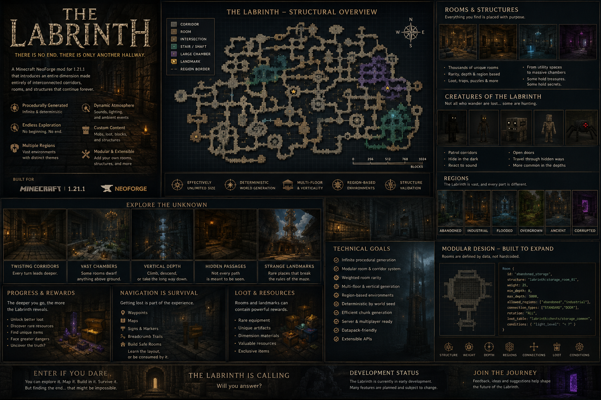

**The dimension itself is the maze.**

As players continue exploring, new sections of the Labrinth generate around them, allowing the structure to sprawl across enormous distances without requiring the entire dimension to be designed by hand.

---

## Procedural Generation

The Labrinth is assembled procedurally from a collection of modular rooms, corridors, connectors, structures, and environmental pieces.

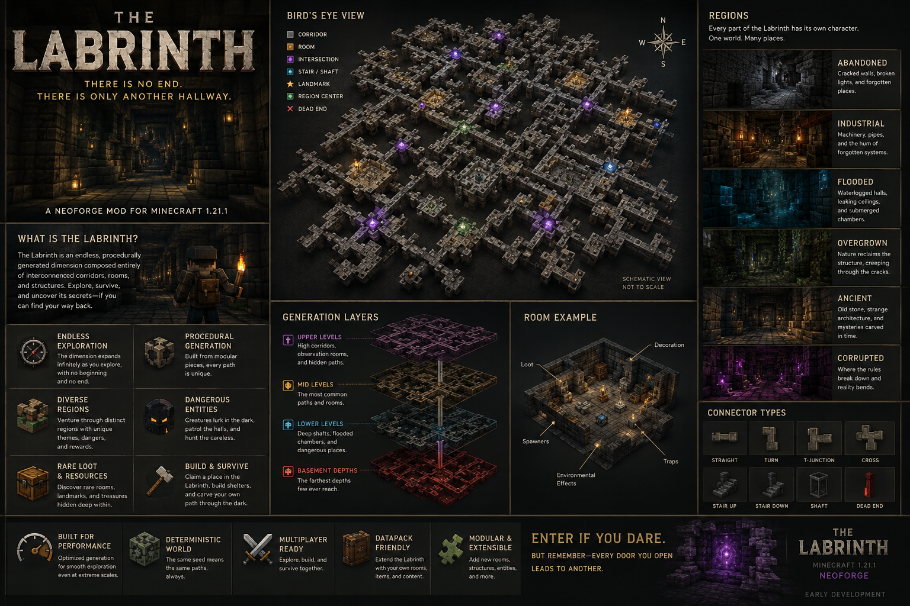

Instead of simply repeating identical hallways, generation can take several factors into account:

* Room rarity
* Corridor length
* Branching frequency
* Vertical connections
* Structure compatibility
* Environmental themes
* Distance traveled
* Local region type
* Neighboring rooms
* Special generation conditions

Some areas may be dense and claustrophobic.

Others may open into enormous chambers or unusually long stretches of hallway.

A corridor that appears meaningless may eventually lead into something valuable.

Or it may lead nowhere at all.

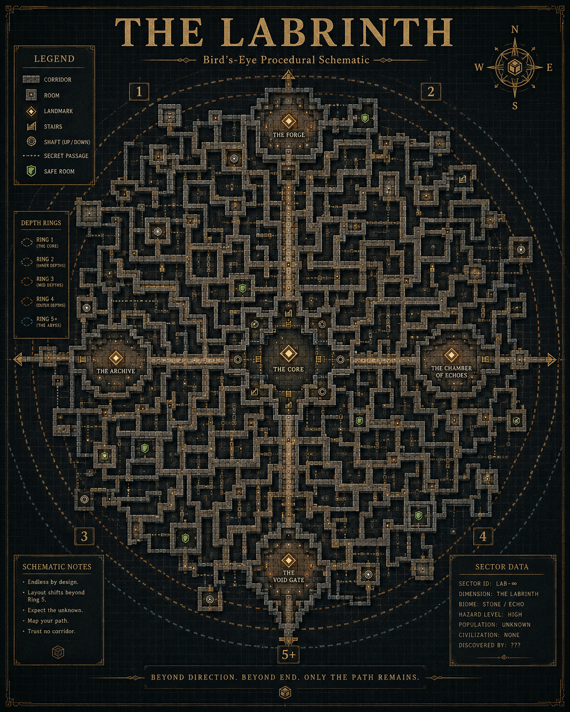

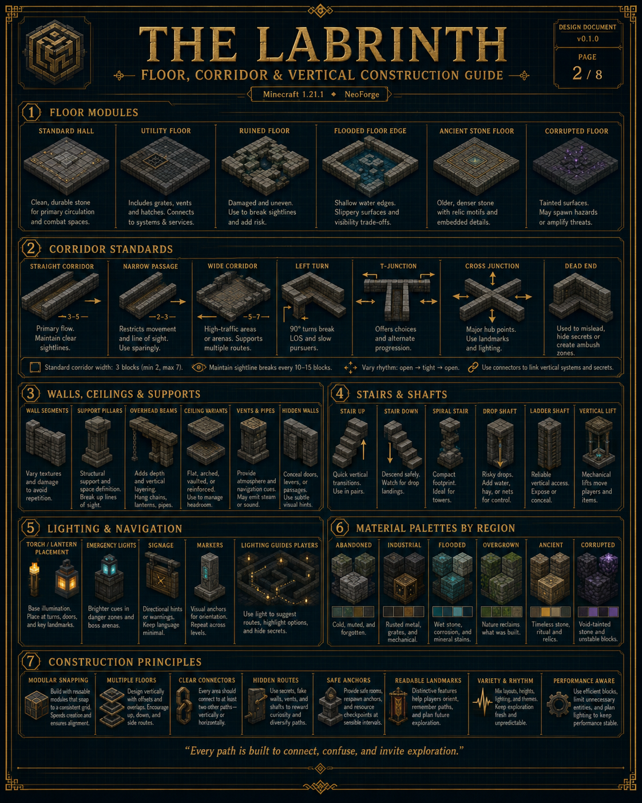

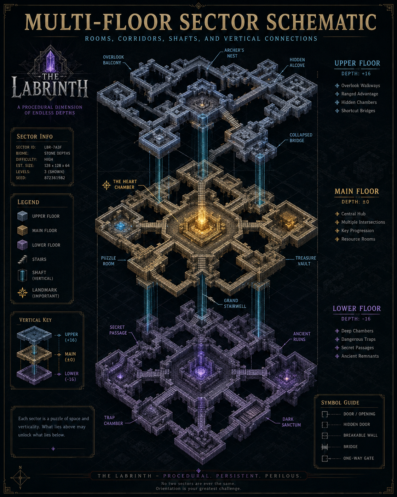

---

## Rooms

Rooms are one of the primary building blocks of the Labrinth.

Individual rooms can contain their own:

* Layout
* Decorations
* Loot
* Blocks
* Lighting
* Traps
* Creatures
* Environmental effects
* Sounds
* Structures
* Interactive elements

Rooms can also have individual rarity values, allowing unusual locations to become genuine discoveries during exploration.

Common utility rooms might appear frequently, while strange or highly valuable rooms could be separated by thousands of blocks.

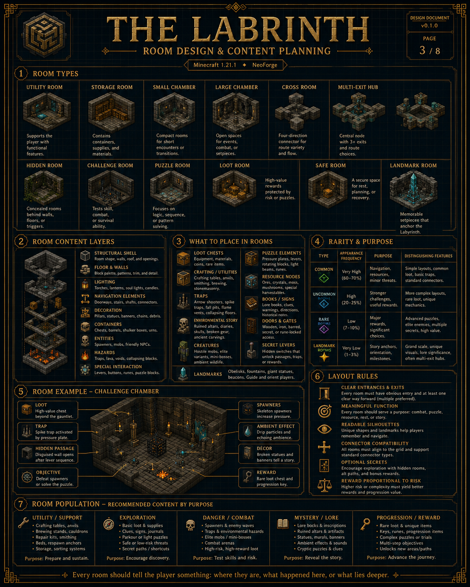

---

## Regions

Although the Labrinth is one continuous structure, not every part of it needs to look the same.

Large portions of the dimension can belong to different **regions** or **themes** that influence what generates there.

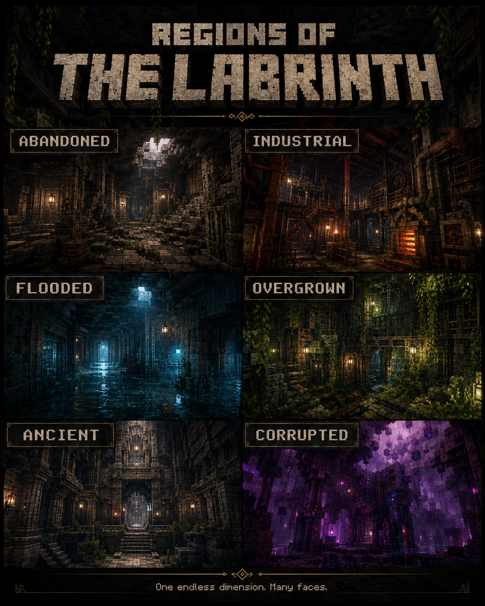

Possible examples include:

### Abandoned

Cracked walls, broken lighting, debris, collapsed passages, and forgotten rooms.

### Industrial

Pipes, machinery, maintenance corridors, storage rooms, vents, and utility infrastructure.

### Flooded

Partially submerged corridors, leaking ceilings, flooded chambers, and waterlogged infrastructure.

### Overgrown

Vegetation slowly reclaiming rooms and hallways that have been abandoned for an unknown amount of time.

### Ancient

Stone corridors, strange architecture, ruins, and structures that appear far older than the rest of the Labrinth.

### Corrupted

Areas where the normal rules of the dimension begin to break down.

Regions do not necessarily have hard borders. One environment may gradually transition into another as the player travels.

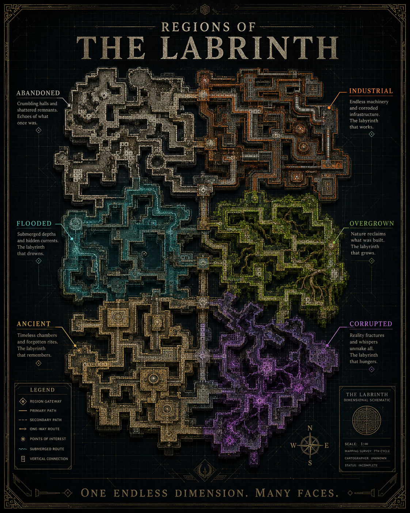

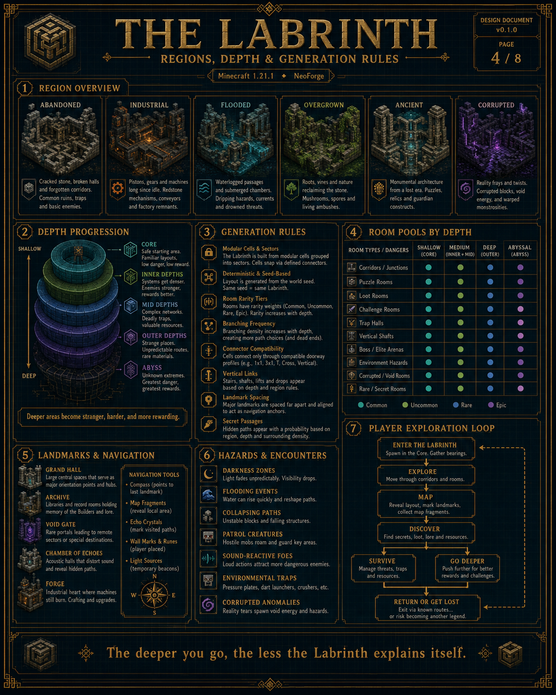

---

## Exploration

The Labrinth is designed around exploration, uncertainty, and discovery.

There is no obvious path forward.

Players may need to remember landmarks, leave markers, build temporary shelters, or develop their own navigation strategies to avoid becoming hopelessly lost.

Going deeper may reveal:

* Better loot
* New room types
* Rare structures
* Unique resources
* More dangerous enemies
* Environmental hazards
* Strange phenomena
* Clues about the Labrinth itself

Distance traveled should matter.

The further a player ventures from familiar territory, the less predictable the dimension can become.

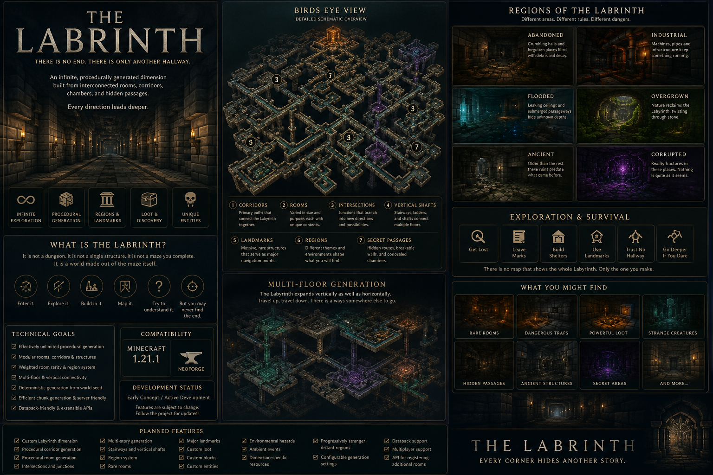

---

## Landmarks

Rare landmarks provide recognizable locations within the otherwise confusing structure of the Labrinth.

Landmarks may be anything from enormous generated rooms to structures that span several floors.

They can serve as:

* Navigation points
* Safe areas
* Loot locations
* Boss arenas
* Story locations
* Transportation hubs
* Resource centers
* Entrances to unusual regions

Finding one should feel significant.

Some landmarks may even influence generation around them.

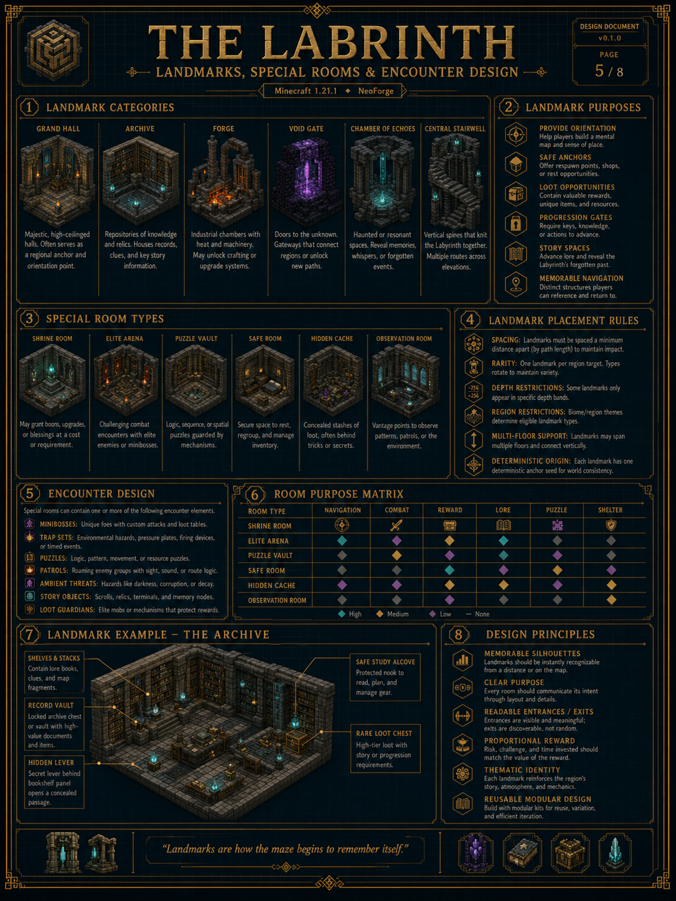

---

## Atmosphere

The Labrinth should feel strange even when nothing is actively attacking the player.

Atmosphere is an important part of the dimension.

Potential environmental systems include:

* Flickering lights
* Distant noises
* Ambient machinery
* Echoing footsteps
* Doors opening or closing
* Environmental particles
* Unusual fog
* Localized darkness
* Electrical failures
* Strange music
* Rare ambient events
* Areas that become unnaturally quiet

Not every sound means something is nearby.

Probably.

---

## Entities

The Labrinth can support creatures designed specifically around enclosed environments.

Rather than simply filling corridors with traditional hostile mobs, entities can interact with the structure itself.

Creatures may:

* Wander between rooms
* Patrol corridors
* Hide in darkness
* Follow sounds
* Open doors
* Crawl through alternate routes
* Guard particular structures
* Appear only within certain regions
* Become more common deeper into the dimension

Some creatures may be hostile.

Others may simply live there.

---

## Loot & Resources

Exploration should provide meaningful rewards.

Rooms and landmarks can contain resources unavailable elsewhere, giving players a reason to repeatedly return to the Labrinth.

Loot may be influenced by:

* Room type
* Region
* Distance traveled
* Structure rarity
* Danger level
* Dimension progression

Rare rooms can contain unique items, equipment, building materials, artifacts, or resources connected directly to the Labrinth.

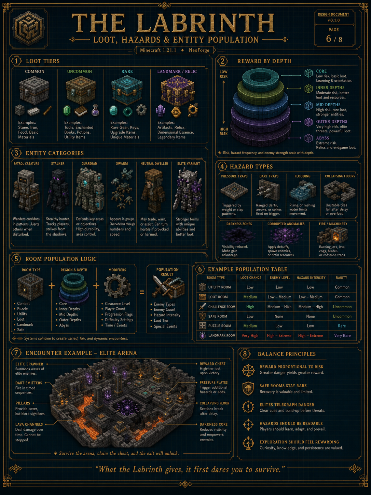

---

## Getting Lost Is Part of the Experience

The Labrinth is intentionally difficult to navigate.

Traditional assumptions about Minecraft exploration may not always work here.

A player may travel hundreds of blocks only to realize they have crossed through the same intersection three times.

Navigation tools therefore become extremely valuable.

Players might rely on:

* Waypoints
* Maps
* Signs
* Torches
* Block markers
* Coordinates
* Breadcrumb trails
* Player-built safe rooms

Exploration becomes less about reaching a destination and more about learning how to survive inside an environment that refuses to be easily understood.

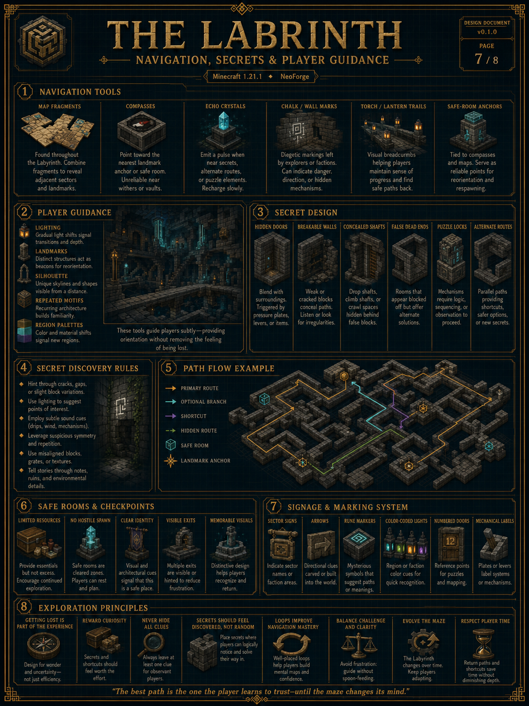

---

## Technical Goals

The Labrinth is being designed for:

**Minecraft:** `1.21.1`
**Mod Loader:** `NeoForge`

Major technical goals include:

* Effectively unlimited procedural generation
* Modular room and corridor generation
* Weighted room rarity
* Multi-floor generation
* Vertical connectivity
* Region-based generation
* Structure validation to prevent impossible connections
* Deterministic world generation based on the world seed
* Efficient chunk generation
* Server compatibility
* Datapack-friendly content where practical
* Extensible APIs for adding new rooms and structures

Performance is particularly important because the Labrinth may contain significantly more generated blocks and enclosed geometry than traditional terrain.

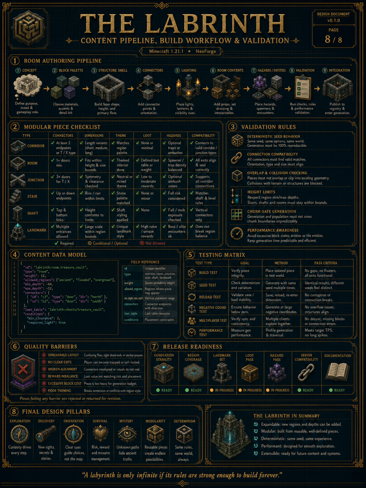

---

## Modular Design

One of the long-term goals of The Labrinth is to make its generation system expandable.

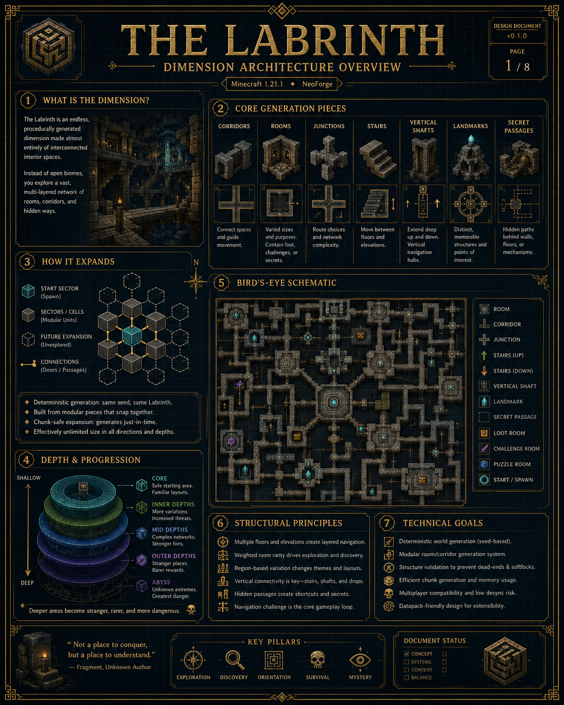

New content should be capable of being added without rewriting the entire dimension generator.

Ideally, additional rooms could define information such as:

```text
Room
├── Structure
├── Weight
├── Minimum Depth
├── Maximum Depth
├── Allowed Regions
├── Connection Types
├── Rotation Rules
├── Loot Table
└── Generation Conditions
```

This would allow the Labrinth's library of possible locations to grow continuously as development continues.

---

## Planned Features

The Labrinth is currently an early concept.

Potential features include:

* [x] Custom Labrinth dimension
* [x] First deterministic straight corridor
* [x] Short straight corridor variant
* [x] Medium straight corridor variant
* [x] Long straight corridor variant
* [x] Turn and junction corridor variants
* [x] Dead-end corridor variant
* [x] Wide and narrow corridor variants
* [x] Curved, S-curve, U-turn, incline, decline, and staircase hallways
* [x] Grand-width counterparts for the hallway shapes and junctions
* [x] Weighted, configurable corridor selection
* [x] Procedural room generation
* [x] Variable-width and variable-height room variants
* [x] Continuous chunk-local expansion
* [x] Multi-story generation
* [x] Stairways and vertical shafts
* [x] Intersections and junctions
* [x] Region system
* [x] Rare rooms
* [x] Major landmarks
* [ ] Custom loot
* [ ] Custom blocks
* [ ] Custom entities
* [ ] Environmental hazards
* [ ] Ambient events
* [ ] Dimension-specific resources
* [x] Progressively stranger distant regions
* [ ] Configurable generation settings
* [ ] Datapack support
* [ ] Multiplayer support
* [ ] API for registering additional rooms

---

## What Is The Labrinth?

It is not a dungeon.

It is not a single generated structure.

It is not a maze that you complete.

It is a **world made out of the maze itself**.

You can enter it.

You can explore it.

You can build inside it.

You can map it.

You can try to understand it.

But you may never find the end.

Because there might not be one.

---

## Development Status

**The Labrinth is currently in early development. Phases 5 through 10 are
complete:** the `labrinth:labrinth` dimension uses deterministic 64-block
generation cells and a mixed room-and-corridor catalog that re-materializes
content as chunks load, including thousands of blocks from the origin without
retaining a pre-generated layout. The catalog includes eighteen registered
room styles—storage, utility, chamber, gallery, archive, reward, decorative,
and test variants—with variable widths and heights, along with twenty-nine
hallway/corridor shapes. Room metadata carries weights, rarity, rotation,
region/depth gates, connectors, placement conditions, decorations, and loot
references. Interiors are materialized chunk-locally with lighting, props,
block variation, visible containers, interactive markers, and capped unmatched
connectors; no neighboring chunks are loaded during selection or rendering.

The active region model resolves one immutable region per owning cell from a
coarse 512-block field. The standard origin core transitions gradually into
weighted Abandoned, Industrial, Flooded, Overgrown, Ancient, and rare
Corrupted areas. Region-specific room/corridor pools, palettes, lighting
outages, bounded decorations, and depth/elevation conditions are applied while
preserving the same chunk-local ownership rules.

The active vertical layer model uses 32-block floor spacing with a starting
floor at Y 4, one floor below at Y -28, and one above at Y 36. The retained
seven-by-seven stair, ladder, drop, and elevator-placeholder definitions bridge
adjacent layers without adding alternate stairwell footprints. The stair route
stays on the inner wall track instead of occupying the stairwell shell. The
dimension now spans Y -32 through 255, leaving room for taller room variants
while preserving the existing top bound.

Logical depth is derived from distance, deterministic branch variation, region
transitions, landmark progression, and floor offset. It gates rare room tiers,
weights branching corridor variants, selects depth-eligible regions, and exposes
loot, entity, hazard, ambient, and unusualness modifiers through each content
placement.

Eight initial landmark definitions are selected once from canonical 32-cell
sector origins. Connection requirements, region/depth/floor restrictions, and
half-open multi-chunk bounds are validated before selection. Intersecting chunks
only rematerialize the origin-owned landmark, and ordinary rooms, corridors, and
vertical pieces yield to its bounds.

Features described in this README represent the intended direction of the project and may change substantially as the generation system is developed.

Minecraft `1.21.1`
NeoForge

---

## License

*TBD*
